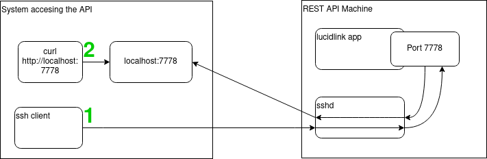

## What is this

This is an example of a bash script that can be used to harden an ubuntu machine and install the lucidlink client

## Assumptions

* The machine where these changes are being performed is meant to be public
* The lucidlink client will create an endpoint that will have to be accessed on rare occasions in a secure manner

## Intended use

This script is intended to be used as a lightweight initialization script. For example this can be what you put in an AWS EC2's user-data

## Tasks
* Create an init/systemd config
  * A simple service file and an environment variables files for the lucidlink service are created. The config file contains various user configurable parameters. The service is registered with the systemd daemon and started at the end
* Export the REST interface to be accessible from the outside in a secure way
  * It is my personal opinion that unless an application is deliberately designed (and maintained) with the intention to be public it should never be directly exposed to the internet. 
  * Accessing the REST API happens via port-forwarding via SSH
* Secure the VM
  * Update the OS packages
  * Enable automatic OS updates
  * Harden ssh by disabling password authentication in favor of only using SSH keys and disabling empty passwords
  * Enable firewall and only allow incoming SSH traffic
* Package the solution in a reusable manner that can be reused on another VM
  * There are multiple ways to deliver this solution. This is a lightweight solution intended to be used as a VM initialization script (for example this would be put in the user-data filed in an AWS EC2 instance)

## TODOs and other changes before using the script in production

* I'd package the systemd service file and the config file in the installer packages, rather than create it via other means
* The password would not be hardcoded in the config file. Instead, it can be either fetched automatically from some sort of secret store, or added to the config manually or automatically when the service is initially configured
* Depending on the use-case I might add a logic that allows me to dynamically select a package version based on certain criteria, rather than hardcode the version
* Right now I have a few extra commands when installing the package dependencies - meant to solve issues during the lucid package installation. Not really an issue, but it bothers me - so I'd probably fix those
* Enabling unattended updates might cause problems. I'd do some research whether it is safe to leave it like this or introduce updates in a much more controller manner. Also - right now automatic updates are just enabled. There are a lot of configurations that can be added to fine-tune what is being installed
* Right now the firewall is there for demonstration purposes. I'll probably do a bit more reading to be sure I'm not missing something (though in the end I want to just allow port 22 in a secure manner). Also, I might constrain the incoming connections to specific IPs/IP ranges if those are known in advance
* Hardcoding an SSH key like that is a bad idea. If there is a company-wide authentication system I'd consider integrating with it. Alternatively a simpler solution would be to periodically sync the allowed SSH keys from somewhere - maybe replace all existing keys with new ones downloaded from a bucket or something along those lines (allowing us to disable keys that were leaked)
* The right now I'm adding the ssh keys to the user with which I'm authenticating. Once it is clear which user will be used for accessing the system - I'd ensure that this is where I add the keys
* I'm not familiar with the product and what kind of permissions it requires, but I'd consider disabling root login via SSH
* I'd move the SSH port to a non-standard port above 30000 to reduce the danger from automated attack
* By default, the API does bind to 127.0.0.1, so explicitly configuring it to that same IP is not really required...

## Some extra finding and things I took in consideration

* I decided to not apply my changes to the VM over the weekend, because any errors in the firewall or sshd settings could result in permanent loss of connectivity (and I did not want to bother the team to restore it)
* it seems that there isn't any help in the application for "lucid daemon help" so it was a bit tricky to find out what kind of parameters it takes
* I think that the instructions on the website for creating a systemd service would expose the credentials if you run "ps aux"
* The script has been tested on a freshly installed machine and works when a real password is supplied

## Accessing the REST API

As mentioned previously the REST API can be accessed via SSH port-forwarding

```
ssh a-valid-user@IP_OF_MACHINE_WHERE_THE_API_RUNS -L 7778:127.0.0.1:7778
```

After executing the command, the REST api will be accessible locally on 127.0.0.1:7778 on the machine from where the SSH connection originated

```
curl 127.0.0.1:7778/app/status
```

## Diagram of the solution

 